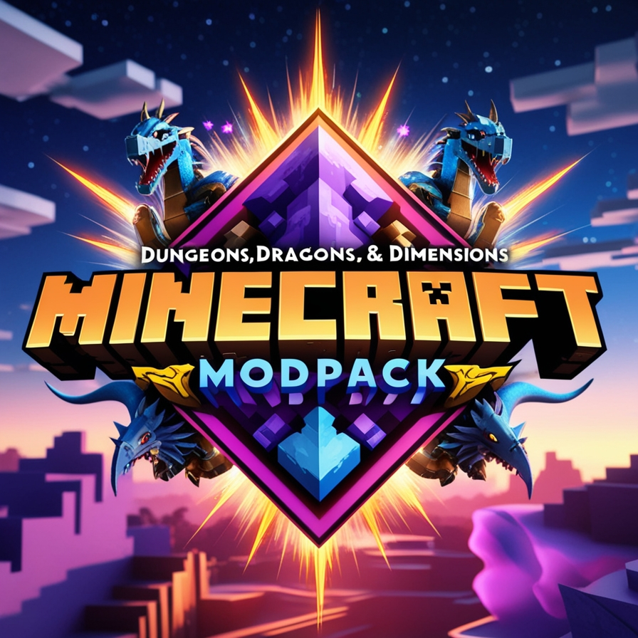

# Modpack Description

Welcome to this kitchen sink modpack, a collection of **300+ mods** spanning categories like **exploration**, **magic**, **technology**, and more. This pack aims to deliver a versatile and expansive Minecraft experience without heavily altering crafting recipes, except for balancing or resolving crafting conflicts.

---

## What Awaits You?

### 🛡️ Adventure and Combat
- **Fight** dragons, new bosses, trolls, mermaids, and other mythical creatures.
- Explore treacherous dungeons and face challenging encounters.

### ⚒️ Crafting and Automation
- **Craft** more armor than you'll ever need on your journey.
- Automate resource collection and processing with:
  - **Create**
  - **Productive Bees**
  - **Mekanism**
  - **Applied Energistics 2** (AE2)
  - ... and many more!

### ⚡ Power Generation and Storage
- Harness massive amounts of energy using:
  - **Mekanism**
  - **EnderIO**
  - **Create: New Ages**
  - ... and other advanced mods.

### 🌌 Exploration and Dimensions
- Discover and explore numerous dimensions, including:
  - **Twilight Forest**
  - **The Aether**
  - **Deep Dark**
  - ... and more yet to uncover!

### 🌍 Custom Overworld Generation
- Traverse a fully customized overworld, featuring:
  - **Terralith**
  - **Biomes O' Plenty**
  - **Alex's Caves**
  - ... for breathtaking landscapes and hidden wonders.

---

## Requirements
To ensure a smooth gameplay experience, you’ll need **at least 8GB of RAM** allocated for this modpack.

---

Enjoy your journey through this immersive modding experience!
